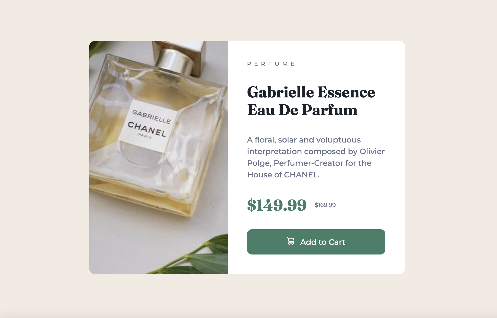
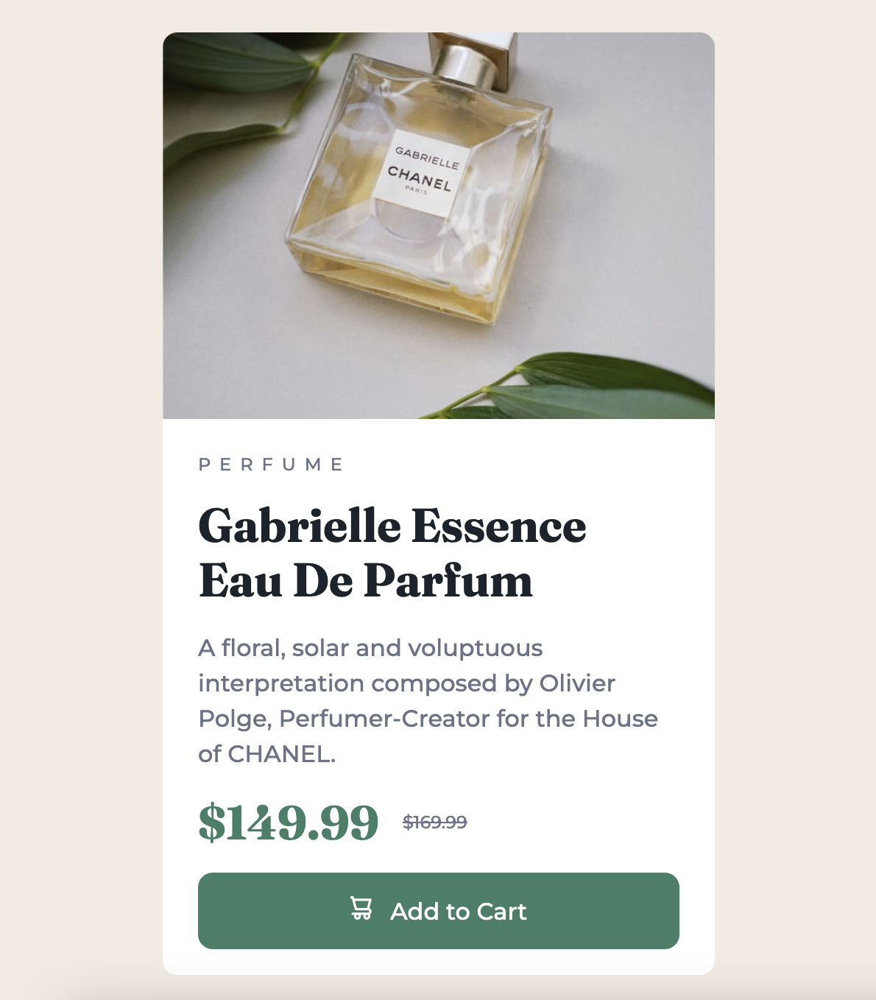

# Frontend Mentor - Product preview card component solution

This is a solution to the [Product preview card component challenge on Frontend Mentor](https://www.frontendmentor.io/challenges/product-preview-card-component-GO7UmttRfa). Frontend Mentor challenges help you improve your coding skills by building realistic projects. 

## Table of contents

- [Overview](#overview)
  - [The challenge](#the-challenge)
  - [Screenshot](#screenshot)
  - [Links](#links)
- [My process](#my-process)
  - [Built with](#built-with)
  - [What I learned](#what-i-learned)
  - [Continued development](#continued-development)
  - [Useful resources](#useful-resources)
- [Author](#author)

## Overview

### The challenge

Users should be able to:

- View the optimal layout depending on their device's screen size
- See hover and focus states for interactive elements

### Screenshots

### Links

- Live Site URL: [Product Preview Component Live Site](https://kaykaym01.github.io/product-preview-component/)
- Solution URL: [Product Preview Component Code](https://github.com/kaykaym01/product-preview-component)

## My process
* Start with mobile design first 
* Add html structure to text 
* Add image
* Set up positioning of elements using flexbox
* Apply topography style for fonts, sizes, and colors
* Touch up any margins and padding
* Add media query for desktop sizes

### Built with

- Semantic HTML5 markup
- CSS custom properties
- Flexbox
- Mobile-first workflow
- Responsive web design

### What I learned

* Responsive web design using media queries
* Designing with a mobile-first workflow 
* Working with responsive sizing (em, rem)
* Structuring websites with flexbox

### Continued development

Use this section to outline areas that you want to continue focusing on in future projects. These could be concepts you're still not completely comfortable with or techniques you found useful that you want to refine and perfect.

* I'd like to get more comfortable using CSS Grid which could have been useful for this project
* Working with images and when to use background images
* Keeping accessibility front of mind when developing the frontend

### Useful resources

- [Image is not resizing in a flexbox layout](https://stackoverflow.com/questions/41774646/image-is-not-resizing-in-a-flexbox-layout) - Struggled with the product image taking up all the space until I learned how min-width is applied with flexbox

## Author

- Frontend Mentor - [@kaykaym01](https://www.frontendmentor.io/profile/kaykaym01)
